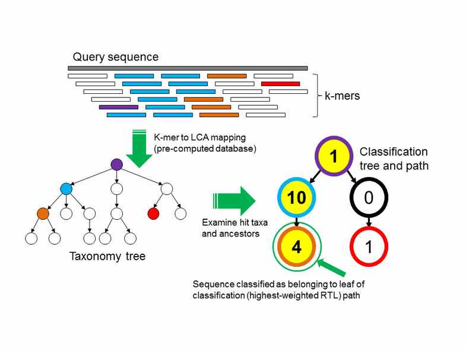
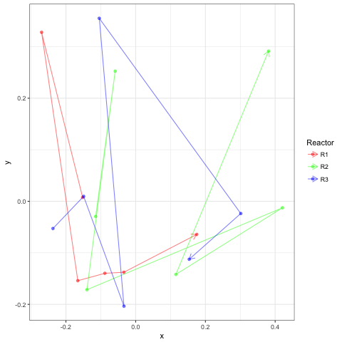
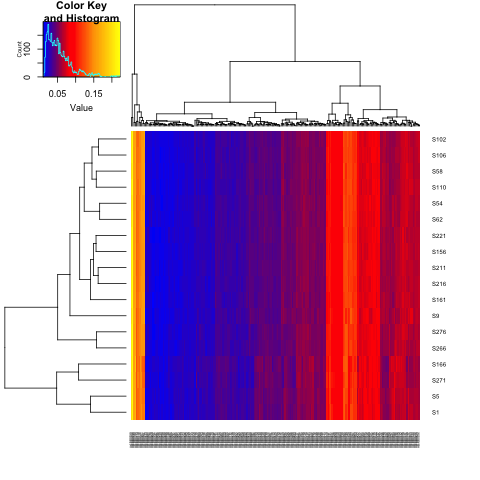
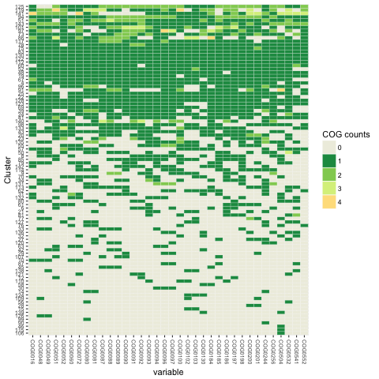
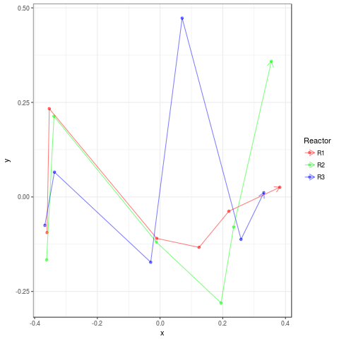
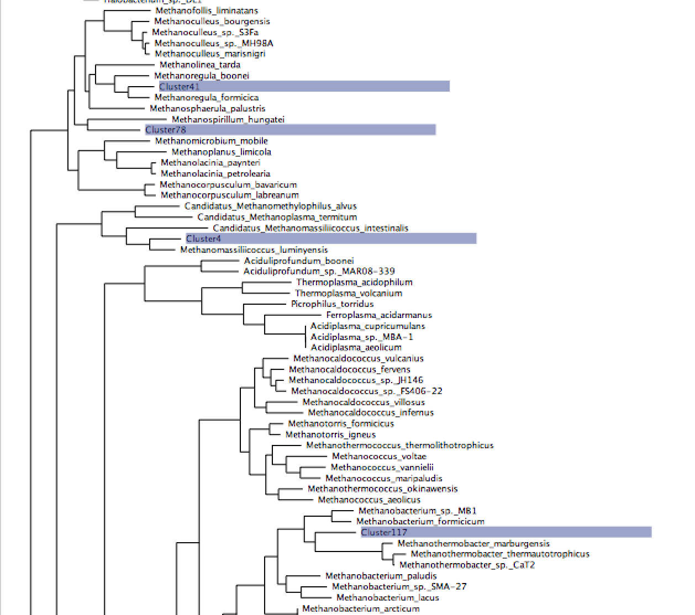

# Mini-metagenome Workshop September 25-27th 2017

## Table of Contents
1. [Getting started](#gettingstarted)

2. [Taxonomic profiling](#taxonomicprofiling)

3. [Functional profiling](#functionalprofiling)

4. [Assembly based metagenomics analysis](#assembly)
* [Coassembly](#coassembly)
* [Read mapping](#readmapping)
* [Contig binning](#binning)

5. [MAGs](#MAGs)

<a name="gettingstarted"/>

## Getting started


Begin by logging into VM:

```
ssh -X ubuntu@137.205.69.49
```

May need this:
```
source .profile 
```

Add this line to .profile using vi:
```
PATH=$HOME/repos/WorkshopSept2017/scripts:$PATH
```

Discussion point environment variables and configuration files.

Clone in the workshop repos:

```
mkdir ~/repos
cd repos
git clone https://github.com/chrisquince/WorkshopSept2017.git
```

and another two we will need:
```
git clone https://github.com/chrisquince/MAGAnalysis.git
git clone https://github.com/chrisquince/StrainMetaSim.git
```

Then we make ourselves a Projects directory:

```
mkdir ~/Projects
mkdir ~/Projects/AD
cd ~/Projects/AD
mkdir Reads
cd Reads
```

### Downloading the raw sequence reads

and download the anaerobic digester sequences:
```
cut -d"," -f7 ~/repos/WorkshopSept2017/data/metaFP1B.csv | sed '1d' > ForwardURL.txt
cut -d"," -f8 ~/repos/WorkshopSept2017/data/metaFP1B.csv | sed '1d' > ReverseURL.txt
```

```
while read line
do
    wget $line
done <  ForwardURL.txt
```

Can you work out how to download the reverse reads?

### Fastq file format

The reads are stored as pairs of fastq files.
```
head -n 10 S102_R1.fastq
```
Sometimes these will be zipped.

Lets have a look at the wikipedia page on [fastq format](https://en.wikipedia.org/wiki/FASTQ_format).

Count up number of reads in a fastq file:
```
cat S102_R1.fastq | echo $((`wc -l`/4))
```

What will the number be in S102_R2.fastq?

Discussion point: What are paired end reads?

Lets counts up reads in all files:
```
for file in *_R1.fastq; do cat $file | echo $((`wc -l`/4)); done > Counts.txt
```

And plot histogram, median read number is 4,917,354:
```
R
>library(ggplot2)
>Counts <- read.csv('Counts.txt',header=FALSE)
>summary(Counts$V1)
>pdf("Counts.pdf")
>qplot(Counts$V1, geom="histogram") 
>dev.off()
>q()
```

Now we run fastqc on one of the samples:
```
fastqc S102_R1.fastq
```

Look at the output files:
```
ls
firefox S102_R1_fastqc.html 
```

<a name="taxonomicprofiling"/>

## Taxonomic profiling

For the taxonomic profiling we are going to subsample the fastq files to 1 million reads each 
for performance purposes.

```
cd ~/Projects/AD
mkdir ReadsSub
for file in Reads/*R1*fastq
do
    base=${file##*/}
    stub=${base%_R1.fastq}
    echo $stub
    seqtk sample -s100 $file 1000000 > ReadsSub/${stub}_Sub_R1.fastq&
    seqtk sample -s100 Reads/${stub}_R2.fastq 1000000 > ReadsSub/${stub}_Sub_R2.fastq&
done
```

We will use Kraken for profiling these reads but first lets convert them to interleaved fastq:

```
mkdir ReadsSub12/
for file in ReadsSub/*R1*fastq
do
    
    stub=${file%_R1.fastq}
    echo $stub
    base=${file##*/}
    python ~/repos/WorkshopSept2017/scripts/Interleave.py $file ${stub}_R2.fastq ReadsSub12/${base}_R12.fastq
    
done

```

How does Kraken work?


Discussion point what is a kmer?

Now run kraken on the interleaved fastq:
```
mkdir Kraken
for file in ReadsSub12/*R12*fastq
do
    base=${file##*/}
    stub=${base%_R12.fastq}
    echo $stub
    kraken --db ~/Databases/minikraken_20141208/ --threads 8 --preload --output Kraken/${stub}.kraken $file
done
```

Look at percentage of reads classified. Anaerobic digesters are under studied communities!

Discussion point what can we do about under representation in Database?

The output is just a text file:

```
head Kraken/S102_Sub.kraken
```

And we can generate a report:

```
kraken-report --db ~/Databases/minikraken_20141208/  Kraken/S102_Sub.kraken >  Kraken/S102_Sub.kraken.report
```

Some people prefer a different format:
```
kraken-mpa-report --db ~/Databases/minikraken_20141208/ Kraken/S102_Sub.kraken > Kraken/S102_Sub.kraken.mpa.report
```

We can get a report of the predicted genera:
```
cat  Kraken/S102_Sub.kraken.report | awk '$4=="G"'
```

Now lets get reports on all samples:
```
for file in Kraken/*.kraken
do
    stub=${file%.kraken}
    echo $stub
    kraken-report --db ~/Databases/minikraken_20141208/ $file >  ${stub}.kraken.report
done
```

Having done this we want to get one table of annotations at the genera level for community comparisons:

```
for file in Kraken/*.kraken.report
do
    stub=${file%.kraken.report}
    cat  $file | awk '$4=="G"' > $stub.genera
done
```

And then run associated script:
```
./CollateK.pl Kraken > GeneraKraken.csv
```
There is a clear shift in genera level structure over time but no association with replicate.



We can generate this plot either locally or on the server by:

```
Rscript ~/repos/WorkshopSept2017/RAnalysis/GeneraKNMDS.R 
```

Discussion points:
1. Non-metric multidimensional scaling
2. Multivariate permutational ANOVA

<a name="functionalprofiling"/>

## Functional gene profiling

To perform functional gene profiling we will use Diamond to map against the KEGG database. 
First we will set an environmental variable to point to our copy of the Kegg:
```
export KEGG_DB=~/Databases/keggs_database/KeggUpdate/
```
```
mkdir KeggD
for file in ReadsSub12/*R12.fastq
do 
   
   stub=${file%_R12.fastq}
   stub=${stub#ReadsSub12\/}
   echo $stub
   if [ ! -f KeggD/${stub}.m8 ]; then
    echo "KeggD/${stub}.m8"
    diamond blastx -d $KEGG_DB/genes/fasta/genes.dmnd -q $file -p 8 -o KeggD/${stub}.m8
   fi
done
```

Having mapped reads to the KEGG genes we can collate these into ortholog coverages:
```
for file in KeggD/*.m8
do
    stub=${file%.m8}

    echo $stub
    
    python ~/bin/CalcKOCov.py $file $KEGG_DB/ko_genes_length.csv $KEGG_DB/genes/ko/ko_genes.list > ${stub}_ko_cov.csv

done
```

Note this script uses a hard coded read length of 150 nt or 50 aa.

Discussion points:

1. What is coverage?

2. What pipelines exist for doing this, HumanN? Could we use kmers for functional profiling?

3. What is the [KEGG](http://www.genome.jp/kegg/pathway.html)

We collate these into a sample table:
```
mkdir FuncResults
CollateKO.pl KeggD > FuncResults/ko_cov.csv
```

and also KEGG modules:
```
for file in KeggD/*ko_cov.csv
do
    stub=${file%_ko_cov.csv}

    echo $stub
    python ~/bin/MapKO.py $KEGG_DB/genes/ko/ko_module.list $file > ${stub}_mod_cov.csv 
done
```

Collate those across samples:
```
CollateMod.pl KeggD > CollateMod.csv
mv CollateMod.csv FuncResults
```

What about module names? My former PDRA (Umer Ijaz) has a nice one liner for this:

```
cd FuncResults
awk -F"," 'NR>1{print $1}' CollateMod.csv | xargs -I {} curl -s http://rest.kegg.jp/find/module/{} > ModNames.txt
cd ..
```

We can view modules as multivariate data just like the genera relative frequencies. Is there a stronger or weaker relationship between time and module abundance than there was 
for the genera abundances?




<a name="assembly"/>

## Assembly based metagenomics analysis

We are now going to perform a basic assembly based metagenomics analysis of these same samples. 
This will involve a collection of different software programs:

1. megahit: A highly efficient metagenomics assembler currently our default for most studies

2. bwa: Necessary for mapping reads onto contigs

3. [samtools] (http://www.htslib.org/download/): Utilities for processing mapped files

4. CONCOCT: Our own contig binning algorithm

5. [prodigal] (https://github.com/hyattpd/prodigal/releases/): Used for calling genes on contigs

6. [gnu parallel] (http://www.gnu.org/software/parallel/): Used for parallelising rps-blast

7. [standalone blast] (http://www.ncbi.nlm.nih.gov/books/NBK52640/): Needs rps-blast

8. [COG RPS database] (ftp://ftp.ncbi.nih.gov/pub/mmdb/cdd/little_endian/): Cog databases

9. [GFF python parser] (https://github.com/chapmanb/bcbb/tree/master/gff)

<a name="coassembly"/>

### Co-assembly

We begin by performing a co-assembly of these samples using a program called megahit:

```
ls ReadsSub/*R1.fastq | tr "\n" "," | sed 's/,$//' > R1.csv
ls ReadsSub/*R2.fastq | tr "\n" "," | sed 's/,$//' > R2.csv
```

```
nohup megahit -1 $(<R1.csv) -2 $(<R2.csv) -t 8 -o Assembly > megahit.out&
```

```
contig-stats.pl < Assembly/final.contigs.fa
```

Should see results like:
```
sequence #: 469120	total length: 412545660	max length: 444864	N50: 1124	N90: 375
```

Discussion point what is N50?

If the assembly takes too long download the results instead:
```
mkdir Assembly
cd Assembly
wget https://septworkshop.s3.climb.ac.uk/final.contigs.fa
cd ..
```

<a name="readmapping"/>

### Read mapping

Then cut up contigs and place in new dir:

```bash


python $CONCOCT/scripts/cut_up_fasta.py -c 10000 -o 0 -m Assembly/final.contigs.fa > Assembly/final_contigs_c10K.fa
```

Having cut-up the contigs the next step is to map all the reads from each sample back onto them. First index the contigs with bwa:

```bash
cd Assembly
bwa index final_contigs_c10K.fa
cd ..
```

Then perform the actual mapping you may want to put this in a shell script:

```bash
mkdir Map

for file in ./ReadsSub/*R1.fastq
do 
   
   stub=${file%_R1.fastq}
   name=${stub##*/}
   
   echo $stub

   file2=${stub}_R2.fastq

   bwa mem -t 8 Assembly/final_contigs_c10K.fa $file $file2 > Map/${name}.sam
done
```

Discussion point how do mappers differ from aligners? Can we list examples of each?

How does (this)[https://en.wikipedia.org/wiki/Burrows%E2%80%93Wheeler_transform]  help DNA sequence analysis!

Discussion point nohup vs screen for long running jobs.


And calculate coverages:

```
python $DESMAN/scripts/Lengths.py -i Assembly/final_contigs_c10K.fa > Assembly/Lengths.txt

for file in Map/*.sam
do
    stub=${file%.sam}
    stub2=${stub#Map\/}
    echo $stub  
    samtools view -h -b -S $file > ${stub}.bam
    samtools view -b -F 4 ${stub}.bam > ${stub}.mapped.bam
    samtools sort -m 1000000000 ${stub}.mapped.bam -o ${stub}.mapped.sorted.bam
    bedtools genomecov -ibam ${stub}.mapped.sorted.bam -g Assembly/Lengths.txt > ${stub}_cov.txt
done
```
Collate coverages together:

```
for i in Map/*_cov.txt 
do 
   echo $i
   stub=${i%_cov.txt}
   stub=${stub#Map\/}
   echo $stub
   awk -F"\t" '{l[$1]=l[$1]+($2 *$3);r[$1]=$4} END {for (i in l){print i","(l[i]/r[i])}}' $i > Map/${stub}_cov.csv
done

$DESMAN/scripts/Collate.pl Map > Coverage.csv
```

<a name="binning"/>

## Contig binning

Now we can run CONCOCT:
```

    mkdir Concoct

    mv Coverage.csv Concoct

    cd Concoct

    tr "," "\t" < Coverage.csv > Coverage.tsv

    concoct --coverage_file Coverage.tsv --composition_file ../Assembly/final_contigs_c10K.fa -t 8 

```

Find genes using prodigal:
```
    cd ..
    
    mkdir Annotate

    cd Annotate/

    python $DESMAN/scripts/LengthFilter.py ../Assembly/final_contigs_c10K.fa -m 1000 >     final_contigs_gt1000_c10K.fa

    prodigal -i final_contigs_gt1000_c10K.fa -a final_contigs_gt1000_c10K.faa -d     final_contigs_gt1000_c10K.fna  -f gff -p meta -o final_contigs_gt1000_c10K.gff > p.out
```

Assign COGs change the -c flag which sets number of parallel processes appropriately:
```
    export COGSDB_DIR=~/Databases/rpsblast_db
    $CONCOCT/scripts/RPSBLAST.sh -f final_contigs_gt1000_c10K.faa -p -c 8 -r 1
```

We are also going to refine the output using single-core gene frequencies. First we calculate scg frequencies on the CONCOCT clusters:
```
cd ../Concoct
python $CONCOCT/scripts/COG_table.py -b ../Annotate/final_contigs_gt1000_c10K.out  -m $CONCOCT/scgs/scg_cogs_min0.97_max1.03_unique_genera.txt -c clustering_gt1000.csv  --cdd_cog_file $CONCOCT/scgs/cdd_to_cog.tsv > clustering_gt1000_scg.tsv
```

Then we need to manipulate the output file formats slightly:
```
sed '1d' clustering_gt1000.csv > clustering_gt1000_R.csv
cut -f1,3- < clustering_gt1000_scg.tsv | tr "\t" "," > clustering_gt1000_scg.csv
$CONCOCT/scripts/Sort.pl < clustering_gt1000_scg.csv > clustering_gt1000_scg_sort.csv
```

Then we can run the refinement step of CONCOCT:
```
concoct_refine clustering_gt1000_R.csv original_data_gt1000.csv clustering_gt1000_scg_sort.csv > concoct_ref.out
```

This should result in 20 clusters with 75% single copy copy SCGs:
```
python $CONCOCT/scripts/COG_table.py -b ../Annotate/final_contigs_gt1000_c10K.out  -m $CONCOCT/scgs/scg_cogs_min0.97_max1.03_unique_genera.txt -c clustering_refine.csv  --cdd_cog_file $CONCOCT/scgs/cdd_to_cog.tsv > clustering_refine_scg.tsv
```

<a name="MAGs"/>

## Metagenome assembled genomes (MAGs)

First let us look at the cluster completeness:
```
$CONCOCT/scripts/COGPlot.R -s clustering_refine_scg.tsv -o clustering_refine_scg.pdf
```

 

Discussion point what is a MAG?

Then we calculate coverage of each cluster/MAG in each sample.
```
sed '1d' clustering_refine.csv > clustering_refineR.csv
python $DESMAN/scripts/ClusterMeanCov.py Coverage.csv clustering_refineR.csv ../Assembly/final_contigs_c10K.fa > clustering_refine_cov.csv
sed 's/Map\///g' clustering_refine_cov.csv > clustering_refine_covR.csv
```

Discussion point, how do we calculate cluster coverages?

How well does this correlate with time/replicates.

 


### Annotate MAGs

First lets label COGs on genes:
```
cd ~/Projects/AD/Annotate
python $DESMAN/scripts/ExtractCogs.py -b final_contigs_gt1000_c10K.out --cdd_cog_file $CONCOCT/scgs/cdd_to_cog.tsv -g final_contigs_gt1000_c10K.gff > final_contigs_gt1000_c10K.cogs
```

Discussion point what is a COG?

Then genes:
```
python $DESMAN/scripts/ExtractGenes.py -g final_contigs_gt1000_c10K.gff > final_contigs_gt1000_c10K.genes
cd ..
```

Return to the analysis directory and create a new directory to bin the contigs into:

```
mkdir Split
cd Split
$DESMAN/scripts/SplitClusters.pl ../Annotate/final_contigs_gt1000_c10K.fa ../Concoct/clustering_refine.csv
$METASIM/scripts/SplitCOGs.pl ../Annotate/final_contigs_gt1000_c10K.cogs ../Concoct/clustering_refine.csv
$METASIM/scripts/SplitGenes.pl ../Annotate/final_contigs_gt1000_c10K.genes ../Concoct/clustering_refine.csv
cd ..
```

```
cp ~/repos/MAGAnalysis/scripts/Prodigal.sh .
./Prodigal.sh 2> Prodigal.out
```

Kegg ortholog assignment on genes:
```
    for file in Cluster*/*faa
    do 
   
    stub=${file%.faa}
    base=${stub##*/}
    echo $base

    diamond blastp -d $KEGG_DB/genes/fasta/genes.dmnd -q $file -p 8 -o ${stub}.m8
    done
```

Discussion point why blastp rather than blastx?

The above maps onto Kegg genes these are then mapped to kegg orthologs by the Perl script:
```
more ~/bin/Assign_KO.pl
```

Run as follows:
```
COUNT=0
for file in Cluster*/*m8
do
	dir=${file%.m8}
	echo $file
	echo $dir
     Assign_KO.pl < $file > ${dir}.hits&
    let COUNT=COUNT+1

    if [ $COUNT -eq 8 ]; then
        wait;
        COUNT=0
    fi
done
```

Discussion point, trivial parallelisation using bash.


We then can create a table of Kegg orthologs across all clusters.
```
~/repos/MAGAnalysis/scripts/CollateHits.pl > CollateHits.csv
```

For Fred's analysis we only want good clusters, select those using R:
```
R
>CollateHits <- read.csv("CollateHits.csv",header=TRUE,row.names=1)
>scg_ref <- read.table("../Concoct/clustering_refine_scg.tsv",header=TRUE,row.names=1)
>scg_ref <- scg_ref[,-1]
>scg_ref <- scg_ref[,-1]
>rownames(scg_ref) <- gsub("^","C",rownames(scg_ref))
>
>CollateHits <- t(CollateHits)
>CollateHits <- CollateHits[rownames(scg_ref),]
>CollateHits75 <- CollateHits[rowSums(scg_ref == 1)/36 > 0.75,]
>CollateHits75 <- CollateHits75[,colSums(CollateHits75) > 0]
>write.csv(t(CollateHits75),"CollateHits75.csv",quote=FALSE)
>q()
```

Discussion point any methanogens?

### Annotate to Kegg modules

Now we find which Kegg modules are present in each cluster by querying their [module reconstruct tool] (http://www.genome.jp/kegg/tool/map_module.html)

```
python ~/repos/MAGAnalysis/scripts/KO2MODULEclusters2.py -i CollateHits75.csv -o Collate_modules.csv 
```

Discussion point, when is a module present? What about methanogenesis modules?

## Taxonomic classification of contigs

There are many ways to taxonomically classify assembled sequence. We suggest a gene based approach. The first step is to call genes on all contigs that are greater than 1,000 bp. Shorter sequences are unlikely to contain complete 
coding sequences. 

Set the environment variable NR_DMD to point to the location of your formatted NR database:
```
export NR_DMD=$HOME/Databases/NR/nr.dmnd
```

Then we begin by copying across the ORFs called on all contigs greater than 1000bp in length.
```
cd ~/Projects/AD/
mkdir AssignTaxa
cd AssignTaxa
cp ../Annotate/final_contigs_gt1000_c10K.faa .
```

Then we use diamond to match these against the NCBI NR.

```
diamond blastp -p 8 -d $NR_DMD -q final_contigs_gt1000_c10K.faa -o final_contigs_gt1000_c10K.m8 > d.out
```

Discussion point, what is the difference between NCBI NR and NT?

Discussion point, what is the difference between diamond blastp and blastx?

To classify the contigs we need two files a gid to taxid mapping file and a mapping of taxaid to full lineage:

1. gi_taxid_prot.dmp

2. all_taxa_lineage_notnone.tsv

These can also be downloaded from the Dropbox:
``` 
wget https://www.dropbox.com/s/x4s50f813ok4tqt/gi_taxid_prot.dmp.gz
wget https://www.dropbox.com/s/honc1j5g7wli3zv/all_taxa_lineage_notnone.tsv.gz
```

The path to these files are default in the ClassifyContigNR.py script as the variables:
```
DEF_DMP_FILE = "/home/ubuntu/Databases/NR/gi_taxid_prot.dmp"

DEF_LINE_FILE = "/home/ubuntu/Databases/NR/all_taxa_lineage_notnone.tsv"
```

We calculate the gene length in amino acids before running this.
Then we can assign the contigs and genes called on them:
```
python $DESMAN/scripts/Lengths.py -i final_contigs_gt1000_c10K.faa > final_contigs_gt1000_c10K.len
python $DESMAN/scripts/ClassifyContigNR.py final_contigs_gt1000_c10K_nr.m8 final_contigs_gt1000_c10K.len -o final_contigs_gt1000_c10K_nr -l /home/ubuntu/Databases/NR/all_taxa_lineage_notnone.tsv -g /home/ubuntu/Databases/NR/gi_taxid_prot.dmp
```

Then we extract species out:
```
$DESMAN/scripts/Filter.pl 8 < final_contigs_gt1000_c10K_nr_contigs.csv | grep -v "_6" | grep -v "None" > final_contigs_gt1000_c10K_nr_species.csv
```

These can then be used for a cluster confusion plot:
```
$CONCOCT/scripts/Validate.pl --cfile=../Concoct/clustering_refine.csv --sfile=final_contigs_gt1000_c10K_nr_species.csv --ffile=../contigs/final_contigs_c10K.fa --ofile=Taxa_Conf.csv
```
Now the results will be somewhat different...
```
N	M	TL	S	K	Rec.	Prec.	NMI	Rand	AdjRand
83423	1181	6.0372e+06	27	145	0.838478	0.985446	0.691768	0.885122	0.771553
```

Then plot:
```
$CONCOCT/scripts/ConfPlot.R -c Taxa_Conf.csv -o Taxa_Conf.pdf
```


## Construct a phylogenetic tree

Assume we are starting from the 'Split' directory in which we have seperated out the cluster fasta files and we have done the COG assignments for each cluster. Then the first step is to extract each of the 36 conserved core COGs individually. There is an example bash script GetSCG.sh for doing this in phyloscripts but it will need modifying:

```
cd ~/Projects/AD/Split
cp ~/repos/MAGAnalysis/cogs.txt .
mkdir SCGs

while read line
do
    cog=$line
    echo $cog
     ~/repos/MAGAnalysis/phyloscripts/SelectCogsSCG.pl ../Concoct/clustering_refine_scg.tsv ../Annotate/final_contigs_gt1000_c10K.fna $cog > SCGs/$cog.ffn
done < cogs.txt
``` 

Run this after making a directory SCGs and it will create one file for each SCG with the corresponding nucleotide sequences from each cluster but only for this with completeness (> 0.75) hard coded in the perl script somewhere you should check that :)

Then we align each of these cog files against my prepared database containing 1 genome from each bacterial genera and archael species:
```
mkdir AlignAll

while read line
do
    cog=$line
    echo $cog
    cat ~/Databases/NCBI/Cogs/All_$cog.ffn SCGs/${cog}.ffn > AlignAll/${cog}_all.ffn
    mafft --thread 64 AlignAll/${cog}_all.ffn > AlignAll/${cog}_all.gffn
done < cogs.txt
```

Then trim alignments:

```
for file in  AlignAll/*gffn
do
    echo $stub
    stub=${file%.gffn}
    trimal -in $file -out ${stub}_al.gfa -gt 0.9 -cons 60
done
```

The next script requires the IDs of any cluster or taxa that may appear in fasta files, therefore:

```
cat AlignAll/*gffn | grep ">" | sed 's/_COG.*//' | sort | uniq | sed 's/>//g' > Names.txt
```

Which we run as follows:

```
~/repos/MAGAnalysis/phyloscripts/CombineGenes.pl Names.txt AlignAll/COG0*_al.gfa > AlignAll.gfa
```

Then we may want to map taxaids to species names before building tree:

```
~/repos/MAGAnalysis/phyloscripts/MapTI.pl /home/ubuntu/repos/MAGAnalysis/data/TaxaSpeciesR.txt < AlignAll.gfa > AlignAllR.gfa
```

Finally we get to build our tree:

```
FastTreeMP -nt -gtr < AlignAllR.gfa 2> SelectR.out > AlignAllR.tree
```

Visualise this locally with FigTree or on the web with ITOL




### Annotating to other functional databases

Other databases are HMM based.

Discussion point what is a hidden Markov model classifier?

The CAZyme database is available standalone from [dbCAN](http://csbl.bmb.uga.edu/dbCAN/)

```
hmmscan --cpu 8 --domtblout final_contigs_gt1000_c10K_faa_dbcan.dm ~/Databases/dbCAN/dbCAN-fam-HMMs.txt.v5 final_contigs_gt1000_c10K.faa  
```

About what E-value and Coverage cutoff thresholds you should use (in order to further parse yourfile.out.dm.ps file), we have done some evaluation analyses using arabidopsis, rice, Aspergillus nidulans FGSC A4, Saccharomyces cerevisiae S288c and Escherichia coli K-12 MG1655, Clostridium thermocellum ATCC 27405 and Anaerocellum thermophilum DSM 6725. Our suggestion is that for plants, use E-value < 1e-23 and coverage > 0.2; for bacteria, use E-value < 1e-18 and coverage > 0.35; and for fungi, use E-value < 1e-17 and coverage > 0.45.

We have also performed evaluation for the five CAZyme classes separately, which suggests that the best threshold varies for different CAZyme classes (please see http://www.ncbi.nlm.nih.gov/pmc/articles/PMC4132414/ for details). Basically to annotate GH proteins, one should use a very relax coverage cutoff or the sensitivity will be low (Supplementary Tables S4 and S9); (ii) to annotate CE families a very stringent E-value cutoff and coverage cutoff should be used; otherwise the precision will be very low due to a very high false positive rate (Supplementary Tables S5 and S10)

## Independent exercises

### Run Kraken on human gut

Download the following healthy human gut samples:

```
wget https://metagexample.s3.climb.ac.uk/Reads.tar.gz
tar -xvzf Reads.tar.gz
```

I want you to subsample, run Kraken and compare to the AD data sets, you can even try assembly!


## Software installation

Going to make an installation directory:
```
mkdir Installation
cd Installation
```

1. Install R on the VM [R-base](https://www.r-bloggers.com/how-to-install-r-on-linux-ubuntu-16-04-xenial-xerus/):
    ```
    sudo echo "deb http://cran.rstudio.com/bin/linux/ubuntu xenial/" | sudo tee -a /etc/apt/sources.list
    gpg --keyserver keyserver.ubuntu.com --recv-key E084DAB9
    sudo apt-get update
    sudo apt-get install r-base r-base-dev
    ```
    and now some R packages:
    ```
    sudo R
    install.packages("ggplot2")
    ```

2. Install FastQC
    ```
    sudo apt-get install fastqc
    ```
    Requires a bug fix:
    ```
    cd ~/Installation
    sudo mkdir /etc/fastqc
    wget https://www.bioinformatics.babraham.ac.uk/projects/fastqc/fastqc_v0.11.5.zip
    unzip fastqc_v0.11.5.zip
    sudo cp -r FastQC /etc/fastqc
    ```

3. Install viewer evince:
    ```
    sudo apt install evince
    ```

4. Install html viewer firefox:
    ```
    sudo apt install firefox
    ```

5. Install Metaphlan2:
    ```
    sudo apt install mercurial
    cd ~/Installation
    hg clone https://bitbucket.org/biobakery/metaphlan2
    ```

    Requires python numpy:
    ```
    sudo apt-get install python-pip
    sudo pip install numpy scipy
    ``
    and also [BowTie2](https://sourceforge.net/projects/bowtie-bio/files/bowtie2/2.3.3)

6. Install Kraken. Get the mini-kraken database:
    ```
    wget http://ccb.jhu.edu/software/kraken/dl/minikraken.tgz   
    git clone https://github.com/DerrickWood/kraken.git
    ```

7. Seqtk
    ```
    cd ~/Installation
    git clone https://github.com/lh3/seqtk.git
    cd seqtk; make
    cp seqtk ~/bin/
    ```

8. Biopython
    ```
    sudo apt-get update
    sudo apt-get install python-biopython
    ```

9. Centrifuge
    ```
    git clone https://github.com/infphilo/centrifuge.git
    ```

10. Megahit
    ```
    git clone https://github.com/voutcn/megahit.git
    cd megahit
    make
    cp megahit* ~/bin
    ```
11. [bwa](https://github.com/lh3/bwa): Necessary for mapping reads onto contigs
    ```
    cd ~/repos
    git clone https://github.com/lh3/bwa.git
    cd bwa; make
    cp bwa ~/bin
    ```

12. [bam-readcount](https://github.com/genome/bam-readcount): Used to get per sample base frequencies at each position

    ```
    cd ~/repos
    sudo apt-get install build-essential git-core cmake zlib1g-dev libncurses-dev patch
    git clone https://github.com/genome/bam-readcount.git
    mkdir bam-readcount-build
    cd bam-readcount-build/
    cmake ../bam-readcount
    make
    cp bin/bam-readcount ~/bin/
    ```

13. [samtools](http://www.htslib.org/download/): Utilities for processing mapped files. The version available through apt will *NOT* work instead...

    ```
    cd ~/repos
    wget https://github.com/samtools/samtools/releases/download/1.3.1/samtools-1.3.1.tar.bz2
    tar xvfj samtools-1.3.1.tar.bz2 
    cd samtools-1.3.1/ 
    sudo apt-get install libcurl4-openssl-dev libssl-dev
    ./configure --enable-plugins --enable-libcurl --with-plugin-path=$PWD/htslib-1.3.1
    make all plugins-htslib
    cp samtools ~/bin/  
    ```

14. [bedtools](http://bedtools.readthedocs.io/en/latest/): Utilities for working with read mappings

    ```
    sudo apt-get install bedtools
    ```

15. [prodigal](https://github.com/hyattpd/prodigal/releases/): Used for calling genes on contigs

    ```
    wget https://github.com/hyattpd/Prodigal/releases/download/v2.6.3/prodigal.linux 
    cp prodigal.linux ~/bin/prodigal
    chmod +rwx ~/bin/prodigal
    ```

16. [gnu parallel](http://www.gnu.org/software/parallel/): Used for parallelising rps-blast

    ```
    sudo apt-get install parallel
    ```

17. [standalone blast](http://www.ncbi.nlm.nih.gov/books/NBK52640/): Need a legacy blast 2.5.0 which we provide as a download:

    ```
    wget https://desmandatabases.s3.climb.ac.uk/ncbi-blast-2.5.0+-x64-linux.tar.gz
    
    tar -xvzf ncbi-blast-2.5.0+-x64-linux.tar.gz
    
    cp ncbi-blast-2.5.0+/bin/* ~/bin
    ```
    
18. [diamond](https://github.com/bbuchfink/diamond): BLAST compatible accelerated aligner

    ```
    cd ~/repos
    mkdir diamond
    cd diamond
    wget http://github.com/bbuchfink/diamond/releases/download/v0.8.31/diamond-linux64.tar.gz
    tar xzf diamond-linux64.tar.gz
    cp diamond ~/bin/
    ```
    
19. We then install both the [CONCOCT](https://github.com/BinPro/CONCOCT) and 
[DESMAN]((https://github.com/chrisquince/DESMAN)) repositories. 
These are both Python 2.7 and require the following modules:
    ```
        sudo apt-get -y install python-pip
        sudo pip install cython numpy scipy biopython pandas pip scikit-learn pysam bcbio-gff
    ```

    They also need the GSL
    ```
        sudo apt-get install libgsl2-dev
        sudo apt-get install libgsl-dev
    ```

    Then install the repos and set their location in your .bashrc:
    ```
    cd ~/repos

    git clone https://github.com/BinPro/CONCOCT.git

    cd CONCOCT
    
    git fetch
    
    git checkout SpeedUp_Mp
    
    sudo python ./setup.py install
    
    ```
    Then DESMAN
    ```
        cd ~/repos

        git clone https://github.com/chrisquince/DESMAN.git

        cd DESMAN

        sudo python ./setup.py install
    ```

    Then add this lines to .bashrc:

    ```
        export CONCOCT=~/repos/CONCOCT
        export DESMAN=~/repos/DESMAN
    ```
20. Hmmer3
```
wget http://eddylab.org/software/hmmer3/3.1b2/hmmer-3.1b2-linux-intel-x86_64.tar.gz
```

We also need some database files versions of which that are compatible with the pipeline 
we have made available through s3. Below we suggest downloading them to a databases directory:

1. COG RPS database: ftp://ftp.ncbi.nih.gov/pub/mmdb/cdd/little_endian/ Cog databases
    
    ```
    mkdir ~/Databases
    cd ~/Databases
    wget https://desmandatabases.s3.climb.ac.uk/rpsblast_cog_db.tar.gz
    tar -xvzf rpsblast_cog_db.tar.gz
    ```
2.  NCBI non-redundant database formatted in old GI format downloaded 02/08/2016 02:07:05. We provide 
this as fasta sequence so that you can diamond format it yourself to avoid any version issues:
    
    ```
    cd ~/Databases
    mkdir NR
    cd NR
    wget https://desmandatabases.s3.climb.ac.uk/nr.faa
    diamond makedb --in nr.faa -d nr
    ```
or we also provide a pre-formatted version:
    ```
    wget https://nrdatabase.s3.climb.ac.uk/nr.dmnd
    ```
    
3. GI to Taxaid and lineage files for the above:
    
    ```
    wget https://desmandatabases.s3.climb.ac.uk/gi_taxid_prot.dmp
    wget https://desmandatabases.s3.climb.ac.uk/all_taxa_lineage_notnone.tsv
